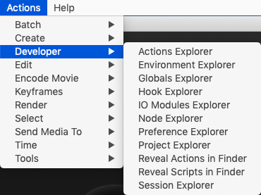
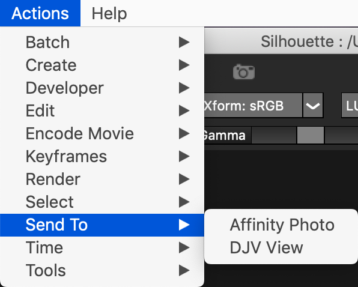
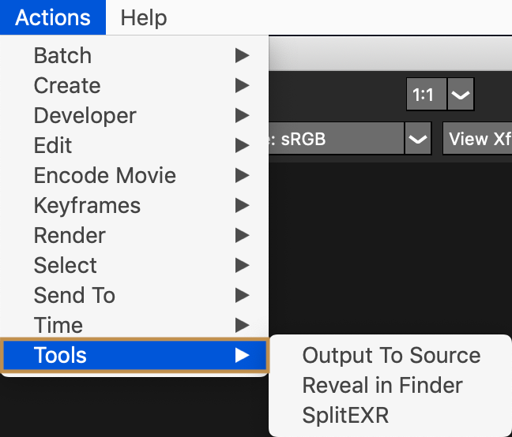

# SilhouetteFX Python Scripts - v1.1 2020-10-27 #

---

Created By: Andrew Hazelden  
Email: [andrew@andrewhazelden.com](mailto:andrew@andrewhazelden.com)  
Web: [http://www.andrewhazelden.com](http://www.andrewhazelden.com)  

## Overview ##

This is a collection of custom python scripts for [SilhouetteFX](http://www.silhouettefx.com/) v7+. These tools help to improve the sfx node based compositing experience and make the artist more productive.

## Actions Menu Items ##

- Developer
	- Actions Explorer
	- Environment Explorer
	- Hook Explorer
	- IO Modules Explorer
	- Node Explorer
	- Preference Explorer
	- Project Explorer
	- Reveal Actions in Finder
	- Reveal Scripts in Finder
	- Session Explorer
- Encode Movie
	- MP4
	- ProRes
	- YouTube LQ
- Send To
	- Affinity Photo
	- DJV View
- Tools
	- Output To Source
	- Reveal in Finder
	- SplitEXR

## Keybind Hotkeys ##

- "**g**" hotkey runs a node alignment script
- "**r**" hotkey runs a "Reveal in Finder" script
- "**Tab**" hotkey runs a "Send To > DJV View" script

The "SplitEXR" functionality is also embedded into the keybinds file so you get auto-magic drag-and-drop EXR channel expansion when you drag an EXR image from your desktop into the SilhouetteFX tree "nodes view" area.

Here's a short video clip of the drag-and-drop plus the SplitEXR tools in action:  
[https://www.youtube.com/watch?v=is82luQSf7A](https://www.youtube.com/watch?v=is82luQSf7A)

## Node Alignment Script ##

There is a custom PySide2 based Node Alignment tool that is embedded in the `keybinds_snippets.py` file. Paste this file's contents into the top of the sfx `scripts/keybinds.py` file and then restart Silhouette.

You can use the Node Alignment tool when you are working in the sfx "Tree" view. Select several nodes and then press the "**g**" hotkey to display the Node Alignment floating window.

Clicking the first "**X**" button in the window will close the floating view you don't want to use any of the buttons in the window.

Here's a short video clip of the node alignment tools in action:  
[https://www.youtube.com/watch?v=dMrfnLQZtMs](https://www.youtube.com/watch?v=dMrfnLQZtMs)

## Install ##

1. Download the contents of the SilhouetteFX-Python-Scripts repository.

2. Open `Scripts` folder, and copy the `compressor` and `icons` resources to your SilhouetteFX `Ressources/scripts/` folder. On macOS that is located at:

`/Applications/SilhouetteFX/Silhouette v7.5/Silhouette.app/Contents/Resources/scripts/`

or

`/Applications/SilhouetteFX/Silhouette 2020.5/Silhouette.app/Contents/Resources/scripts/`

3. Copy the .py scripts from inside the `scripts/actions/` folder into your SilhouetteFX `Ressources/scripts/actions/` folder. On macOS that is located at:

`/Applications/SilhouetteFX/Silhouette v7.5/Silhouette.app/Contents/Resources/scripts/actions/`

or

`/Applications/SilhouetteFX/Silhouette 2020.5/Silhouette.app/Contents/Resources/scripts/actions/`

4. Open the `scripts/actions/keybinds_snippets.py` Python script in a programmer's text editor. This file has a snippet of custom code that provides drag and drop support, along with Trees view grid layout snapping tools. You need to add this content via copy/paste to the top of the SilhouetteFX's built-in `keybinds.py` file by replacing this text area with the new code:

		import fx

		#
		# Helper function which returns a function that calls
		# a specified method of an object, passing in the argument list.
		# Used to replace 'lambda', which is being phased out
		#
		def callMethod(func, *args, **kwargs):
			def _return_func():
				return func(*args, **kwargs)
			return _return_func

SilhouetteFX's built-in `keybinds.py` file is located at:

`/Applications/SilhouetteFX/Silhouette v7.5/Silhouette.app/Contents/Resources/scripts/keybinds.py`

or

`/Applications/SilhouetteFX/Silhouette 2020.5/Silhouette.app/Contents/Resources/scripts/keybinds.py`

**Note:** *It's a good idea to save a copy of your original `keybinds.py` file as `keybinds.bak` when you edit it.*

5. Edit the `keybinds.py` file and change the entries below to point to the correct paths for your current SilhouetteFX install:

SaveByCSV() / AlignByCSV() Functions:

`path = '/Applications/SilhouetteFX/Silhouette v7.5/Silhouette.app/Contents/Resources/scripts/node_shape.csv'`

SnapDialog() Function:

`iconFolder = '/Applications/SilhouetteFX/Silhouette v7.5/Silhouette.app/Contents/Resources/scripts/icons/'`

runDJV() Function:

`cmd = "/Applications/DJV.app/Contents/Resources/bin/djv_view.sh"`

## Screenshots ##

Last Revised 2020-10-27
