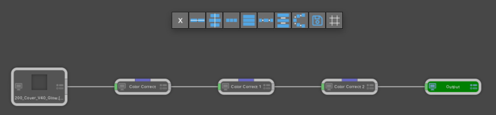

# SilhouetteFX Python Scripts - 2018-12-15 #

---

Created By: Andrew Hazelden  
Email: [andrew@andrewhazelden.com](mailto:andrew@andrewhazelden.com)  
Web: [http://www.andrewhazelden.com](http://www.andrewhazelden.com)  

## Overview ##

This is a collection of custom python scripts for [SilhouetteFX](http://www.silhouettefx.com/) v7+. These tools help to improve the sfx node based compositing experience and make the artist more productive.

## Actions Menu Items ##

- Developer
	- Actions Explorer
	- Environment Explorer
	- Hook Explorer
	- IO Modules Explorer
	- Node Explorer
	- Preference Explorer
	- Project Explorer
	- Reveal Actions in Finder
	- Reveal Scripts in Finder
	- Session Explorer
- Encode Movie
	- MP4
	- ProRes
	- YouTube LQ
- Send To
	- Affinity Photo
	- DJV View
- Tools
	- Output To Source
	- Reveal in Finder
	- SplitEXR

## Keybind Hotkeys ##

- "**g**" hotkey runs a node alignment script
- "**r**" hotkey runs a "Reveal in Finder" script
- "**Tab**" hotkey runs a "Send To > DJV View" script

The "SplitEXR" functionality is also embedded into the keybinds file so you get auto-magic drag-and-drop EXR channel expansion when you drag an EXR image from your desktop into the SilhouetteFX tree "nodes view" area.

## Node Alignment Script ##

There is a custom PySide2 based Node Alignment tool that is embedded in the `keybinds_snippets.py` file. Paste this file's contents into the top of the sfx `scripts/keybinds.py` file and then restart Silhouette.

You can use the Node Alignment tool when you are working in the sfx "Tree" view. Select several nodes and then press the "**g**" hotkey to display the Node Alignment floating window.

Clicking the first "**X**" button in the window will close the floating view you don't want to use any of the buttons in the window.

Last Revised 2018-12-15
